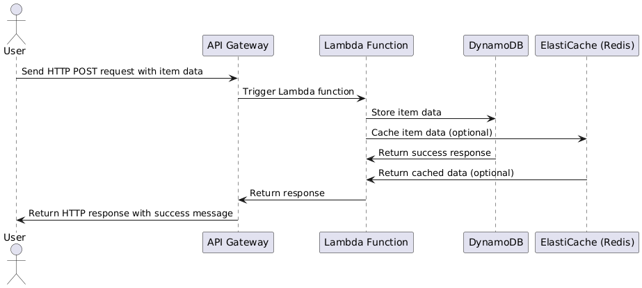
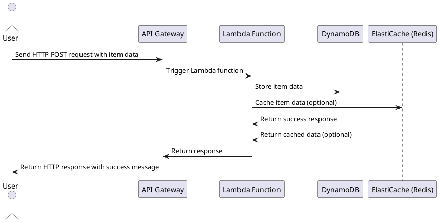

# Fulcrum

**Fulcrum** is an AWS cloud-based project that leverages DynamoDB, ElastiCache (Redis), Lambda, and API Gateway. The infrastructure is built with Terraform and is deployable to multiple AWS regions. GitHub Actions automate the deployment process to ensure efficient and reliable infrastructure management.

---

## Table of Contents

- [Overview](#overview)
- [Features](#features)
- [Directory Structure](#directory-structure)
- [Setup Instructions](#setup-instructions)
    - [Pre-requisites](#pre-requisites)
    - [Getting Started](#getting-started)
- [Deployment](#deployment)
- [Example API Request](#example-api-request)
- [PlantUML Sequence Diagram](#plantuml-sequence-diagram)

---

## Overview

Fulcrum implements a serverless architecture to manage item data with the following schema:
- **itemNumber**: Unique identifier (Primary Key).
- **timestamp**: Time of data entry (Numeric).
- **status**: Current status of the item.
- **description**: Description of the item.

Key AWS services include:
- **DynamoDB**: For persistent data storage.
- **ElastiCache (Redis)**: For caching frequent queries.
- **Lambda**: To handle API calls.
- **API Gateway**: To provide an HTTP interface for Lambda.

---

## Features

- **Multi-region Deployment**: Supports independent infrastructure deployments for multiple AWS regions.
- **GitHub Actions**: Automates deployment workflows.
- **Serverless**: Cost-effective and highly scalable.
- **Fully Terraform-Managed**: Infrastructure-as-Code (IaC).

---

## Directory Structure

```plaintext
Fulcrum/
│
├── us-east-1/                # Resources for us-east-1
│   ├── networking/          # VPC and Subnet configuration
│   ├── dynamodb/            # DynamoDB table
│   ├── redis/               # ElastiCache configuration
│   ├── lambda/              # Lambda function and related files
│   ├── api-gateway/         # API Gateway configuration
│
├── us-west-2/                # Resources for us-west-2
│   ├── networking/
│   ├── dynamodb/
│   ├── redis/
│   ├── lambda/
│   ├── api-gateway/
│
├── .github/                 # GitHub workflows for CI/CD
│   ├── workflows/
│       ├── deploy-us-east-1.yml
│       ├── deploy-us-west-2.yml
│
└── README.md                # Project documentation
```
## Setup Instructions

Pre-requisites
 - AWS Account: Create an account at AWS.
 - Terraform: Install Terraform.
 - AWS CLI: Install the AWS CLI and configure your credentials:
``` shell
aws configure
```
 - GitHub Account: For repository and Actions setup.
 - Zsh: Ensure you have Zsh installed to run the setup script.
```shell
git clone https://github.com/yourusername/Fulcrum.git
cd Fulcrum
```

## Deployment
### Deploy to us-east-1:
  Push changes to the us-east-1 branch:
```shell
git checkout us-east-1
git add .
git commit -m "Deploy to us-east-1"
git push origin us-east-1
```
### Deploy to us-west-2:
Push changes to the us-west-2 branch:
```shell
git checkout us-west-2
git add .
git commit -m "Deploy to us-west-2"
git push origin us-west-2
```
GitHub Actions will automatically execute the workflows and deploy resources.

## Example API Request
After deployment, you can use the API Gateway endpoint to interact with the Lambda function. Use the following HTTP POST request to add an item:

### Request
```shell
curl -X POST \
  -H "Content-Type: application/json" \
  -d '{
        "itemNumber": "12345",
        "status": "active",
        "description": "Sample item"
      }' \
  https://<API-Gateway-Endpoint>/add
```
### Response
```shell
{
  "message": "Item added successfully!"
}
```
## PlantUML Sequence Diagram


